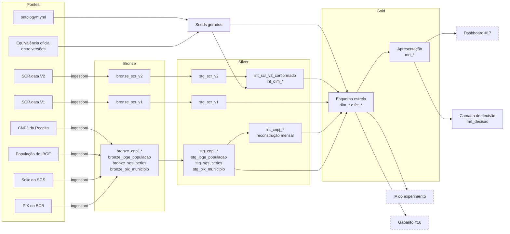

# Crédito no Brasil: do dado oficial até a decisão, e quanto a IA acerta no caminho

Este projeto responde a duas perguntas sobre os mesmos dados públicos de crédito do Banco Central.

**De negócio:** uma financeira quer crescer em crédito para pessoa jurídica. Em quais modalidades e estados vale aumentar exposição, e onde o risco está piorando rápido demais para isso?

**De método:** quanto uma ontologia curada melhora a acurácia de um LLM ao responder as perguntas de que essa decisão depende, e se ela vale mais do que os próprios documentos de onde foi destilada, recuperados por busca num RAG?

*Two questions over the same public Brazilian Central Bank credit data: where a lender should grow and where risk is deteriorating, and how much a curated ontology improves an LLM's accuracy on the questions that decision depends on, compared with retrieving the very documents it was distilled from.*

> **Status:** v0.1 em construção. Este aviso será substituído por resultados conforme cada versão for publicada.

---

## A decisão que o projeto sustenta

A entrega final não é um painel de indicadores, é uma recomendação: onde entrar, onde manter e onde não entrar, por estado e modalidade, com o custo de errar e com **a lista do que este dado não permite afirmar.** O SCR é agregado e não traz taxa nem receita, então rentabilidade, spread e comportamento de instituição específica ficam fora, e isso é dito junto da recomendação.

A recomendação está em [`docs/recomendacao.md`](docs/recomendacao.md), gerada do mart de decisão sem nenhum número digitado à mão, e a regra da matriz no [ADR 0014](docs/adr/0014-matriz-de-decisao-espaco-contra-risco.md). O raciocínio de terminar numa recomendação está no [ADR 0005](docs/adr/0005-projeto-termina-em-recomendacao.md).

## O problema

Toda empresa que tenta colocar IA sobre seus próprios dados esbarra na mesma parede: o modelo não erra por falta de capacidade, erra por falta de contexto. Nome de coluna críptico, valor sentinela não documentado, taxonomia que mudou no meio da série, duas métricas parecidas com definições regulatórias diferentes. O dado está lá, mas o significado não.

Este projeto mede esse efeito com dado público real, e com método que qualquer pessoa pode auditar e reproduzir.

## O que este projeto é, e o que não é

**Uma parte é replicação.** O efeito de metadado sobre acurácia de text-to-SQL já está estabelecido na literatura (ver `docs/referencias.md`) e já é premissa de produtos comerciais como Databricks Genie, Snowflake Cortex Analyst e a camada semântica do dbt. Medi-lo aqui é replicação transparente em domínio novo: dado regulatório brasileiro, em português, com deriva de taxonomia verdadeira e documentada.

**A outra parte busca uma descoberta.** Vale o trabalho de curar uma ontologia, se os mesmos documentos de onde ela foi destilada podem ser recuperados por busca num RAG? O experimento compara quatro condições (só o esquema, só a ontologia, só os documentos e as duas camadas juntas), com hipóteses de direção registradas antes de qualquer execução ([ADR 0013](docs/adr/0013-experimento-2x2-ontologia-contra-documentos.md)). É a pergunta que decide entre montar uma camada semântica e jogar documentos num RAG. O resultado vale para este domínio, com tamanho de efeito, e não como lei geral.

O mesmo desenho vira ferramenta: um assistente para pessoas de negócio, dentro do dashboard, que responde com o número, o SQL que o produziu, os conceitos da ontologia usados e a ressalva que o torna interpretável ([ADR 0012](docs/adr/0012-assistente-de-dados-com-modelo-aberto-e-aplicacao-de-custo-zero.md)).

## Por que os dados do SCR

O [SCR.data](https://dadosabertos.bcb.gov.br/dataset/scr_data) do Banco Central publica a carteira de crédito do sistema financeiro nacional, mensalmente, com recorte por UF, modalidade, porte, setor e tipo de cliente.

Três características o tornam ideal para este estudo:

1. **A bagunça é real e não foi plantada.** Valor sentinela `-1` sem documentação e com critério desconhecido, delimitador `;` dentro de campo entre aspas, vírgula decimal em texto, UTF-8 com BOM que abre "sem erro" em latin-1 e corrompe os acentos, e duas métricas distintas com nomes parecidos (`carteira_inadimplencia` e `ativo_problematico`).
2. **A taxonomia mudou de verdade.** Há quebra metodológica documentada entre a Versão 1 e a Versão 2, com PDFs oficiais explicando cada uma. Isso permite testar a pergunta mais difícil do conjunto: como uma mudança de classificação afeta a comparabilidade da série histórica.
3. **O significado é auditável na fonte.** A ontologia deste projeto é destilada dos normativos oficiais do BCB, não inventada. Cada definição cita o documento de origem.

## Arquitetura

```
Fonte oficial (ZIP anual, 100 a 300 MB por mês de CSV)
        ↓  ingestão em Python
Databricks (Delta / Unity Catalog)
        ↓  dbt: staging → intermediate → marts
Camada semântica + ontologia versionada
        ↓
   ┌────┴────┐
Dashboard   Interface de IA + avaliação medida
da decisão  (com e sem ontologia)
```

### Arquitetura medalhão

As camadas seguem a arquitetura medalhão, com o nome que cada uma tem no dbt:

| Medalhão | Camada no projeto | O que faz | Onde está |
|---|---|---|---|
| **Bronze** | Tabelas bronze | O dado exatamente como o BCB publica, todo em texto, com linhagem por arquivo | `ingestion/`, [ADR 0004](docs/adr/0004-ingestao-em-camada-bronze.md) |
| **Silver** | Staging | Corrige a forma e preserva o conteúdo: tipos, trim, sentinelas | `dbt/models/staging/`, [ADR 0006](docs/adr/0006-staging-corrige-forma-preserva-conteudo.md) |
| **Silver** | Intermediate | Resolve as dimensões: código da submodalidade, colunas polimórficas desambiguadas e conformação com a V1 | `dbt/models/intermediate/` |
| **Gold** | Esquema estrela | Responde às perguntas. É o que a IA consulta no experimento | `dbt/models/marts/`, `dim_*` e `fct_*` |
| **Gold** | Apresentação | Agregado no grão das telas do dashboard, com as taxas calculadas uma vez | `dbt/models/marts/`, `mrt_*` |



Tracejado é o que ainda não foi construído, com o número da issue. O esquema estrela, o caminho da ontologia até o modelo e as camadas de verificação estão desenhados em [`docs/arquitetura.md`](docs/arquitetura.md). Os diagramas são código, e não imagem, pelo motivo do [ADR 0008](docs/adr/0008-diagramas-como-codigo-em-mermaid.md).

A camada gold tem duas famílias porque perguntas e dashboard puxam em direções opostas, e porque aquilo que a IA consulta define o que o experimento mede. O raciocínio está no [ADR 0007](docs/adr/0007-gold-estrela-para-perguntas-apresentacao-para-dashboard.md).

**Decisão de desenho central:** a dimensão de modalidade não é escrita à mão no dbt, ela é **gerada a partir de `ontology/modalidades.yml`**. A ontologia é fonte do modelo, não documentação sobre ele. Assim, divergência entre documentação e dado se torna estruturalmente impossível.

As decisões de arquitetura e suas alternativas descartadas estão registradas em `docs/adr/`.

## Estrutura do repositório

| Pasta | Conteúdo |
|---|---|
| `ingestion/` | Da fonte oficial à camada bronze no Databricks, com manifesto de linhagem |
| `ontology/` | Ontologia, glossário e contratos de dados, com citação normativa |
| `dbt/` | Camada semântica: staging, intermediate, marts, testes |
| `evaluation/` | Perguntas de negócio, gabarito e análise estatística |
| `dashboard/` | Aplicação do dashboard, para o Hugging Face Spaces |
| `scripts/` | Utilitários e verificadores |
| `docs/adr/` | Registro de decisões de arquitetura |

### Como rodar a ingestão

Pré-requisitos: [uv](https://docs.astral.sh/uv/) e o [Databricks CLI](https://docs.databricks.com/dev-tools/cli/) autenticado por OAuth (`databricks auth login`). Nenhuma credencial fica no repositório.

```bash
uv run python -m ingestion.baixar             # ZIPs oficiais do SCR para data/raw/ e manifesto
uv run python -m ingestion.converter_parquet  # CSV para Parquet só texto, com validação
uv run python -m ingestion.baixar_cnpj        # CNPJ da Receita, três retratos, cerca de 16 GB
uv run python -m ingestion.converter_cnpj     # CNPJ para Parquet só texto, em partes
uv run python -m ingestion.baixar_ibge        # população por UF, SIDRA 6579
uv run python -m ingestion.baixar_sgs         # meta da Selic, série 432 do SGS
uv run python -m ingestion.baixar_pix         # PIX por município, meses fechados
uv run python -m ingestion.enviar_volume      # schema, volume e envio ao Unity Catalog
uv run python -m ingestion.criar_bronze       # tabelas bronze do SCR e das fontes externas
uv run python -m ingestion.verificar_bronze   # prova que o bronze é o dado publicado
```

Todas as etapas são idempotentes. O raciocínio está no [ADR 0004](docs/adr/0004-ingestao-em-camada-bronze.md) e, para as fontes externas, no [ADR 0009](docs/adr/0009-empresas-ativas-reconstruidas-de-um-retrato-do-cnpj.md).

Para conferir a ontologia de modalidades contra o dado do bronze:

```bash
uv run python -m scripts.validar_modalidades
```

Para gerar e conferir o seed de correspondência entre as versões V2 e V1:

```bash
uv run python -m scripts.gerar_seed_correspondencia
uv run python -m scripts.validar_correspondencia
```

Para gerar as dimensões a partir da ontologia. Elas nunca são escritas à mão, e é isso que torna impossível a documentação divergir do modelo sem alguém notar:

```bash
uv run python -m scripts.gerar_seeds_da_ontologia
```

As validações têm duas camadas. A que compara com o dado exige acesso ao Databricks e roda localmente. A que confere apenas a coerência dos artefatos roda sem credencial, e é a que o CI executa em todo PR:

```bash
uv run python -m scripts.validar_modalidades --estrutura
uv run python -m scripts.validar_dimensoes --estrutura
uv run python -m scripts.validar_correspondencia --estrutura
uv run python -m scripts.validar_perguntas
uv run python -m scripts.validar_cobertura
```

Para conferir a ontologia de dimensões contra o dado, incluindo se cada valor ocorre nos tipos de cliente que a ontologia declara:

```bash
uv run python -m scripts.validar_dimensoes
```

### Como rodar a camada semântica

Do diretório `dbt/`, com o mesmo OAuth do CLI e um `~/.dbt/profiles.yml` copiado de [`dbt/profiles.yml.example`](dbt/profiles.yml.example):

```bash
uv run dbt build
```

O comando carrega os seeds, cria as views de staging e de intermediate, as tabelas da camada gold e roda os testes. Hoje são 306 verificações, e três avisam de propósito, cada uma por um defeito do próprio dado publicado. A identidade `carteira_ativa = carteira_a_vencer + carteira_vencida` falha em uma linha de dez/2024 do arquivo do BCB; a tabela Empresas da Receita traz uma empresa repetida; e o PIX pago no país não bate com o recebido em dois meses de 2025, por cerca de R$ 1,2 milhão. Cada teste avisa com os casos conhecidos e falha com um a mais, para que uma nova ocorrência não passe em silêncio. O raciocínio do staging está no [ADR 0006](docs/adr/0006-staging-corrige-forma-preserva-conteudo.md).

A camada intermediária resolve as dimensões: ela traz o código do Anexo 3 que o dado publicado não tem, desfaz a ambiguidade das duas colunas polimórficas no formato que a V1 usava, e liga cada linha à modalidade correspondente da V1 pela tabela oficial de equivalência. Os testes de relacionamento provam que nenhuma linha fica sem dimensão, e um teste de contagem e soma prova que as junções não multiplicam linha.

A camada gold reproduz todo número já publicado nos documentos do projeto, e um teste confere mês a mês que o dashboard e a IA veem os mesmos totais. A matriz em [`evaluation/cobertura.yml`](evaluation/cobertura.yml) diz, para cada pergunta e cada tela, os modelos que a respondem ou a issue que ainda a bloqueia: hoje, 30 das 41 perguntas são respondíveis só com o SCR.

Para o QA da camada, por caminhos diferentes dos testes do dbt, incluindo a conferência das linhas contra o manifesto medido fora do Databricks e a varredura da cardinalidade mês a mês:

```bash
uv run python -m scripts.analises.qa_staging
```

### Documentação

| Documento | O que traz |
|---|---|
| [Especificação](docs/especificacao.md) | Arquitetura, esquema da fonte, camadas do dbt, desenho do experimento |
| [Referências](docs/referencias.md) | Literatura e premissa de mercado que sustentam a tese |
| [Desenvolvimento com IA](docs/desenvolvimento-com-ia.md) | O processo de ponta a ponta, incluindo os erros da IA e como foram pegos |
| [Análise V1 e V2](docs/analise-v1-v2.md) | A quebra de taxonomia entre as duas versões do SCR.data |
| [Leitura dos normativos](docs/leitura-normativos.md) | O que as metodologias oficiais respondem, e o que não respondem |
| [Cadeia normativa](docs/cadeia-normativa.md) | Por que o dado mudou: leiaute, instruções do documento 3040 e as normas por trás de cada quebra |
| [Triagem da ontologia](docs/triagem-ontologia.md) | Decisões de domínio que a ontologia exigiu |
| [O valor -1](docs/sentinela-numero-de-operacoes.md) | Teste empírico que refutou a leitura inicial do sentinela |
| [ADR 0001](docs/adr/0001-credenciais-e-dado-bruto-fora-do-repositorio.md) | Credenciais e dado bruto fora do repositório |
| [ADR 0002](docs/adr/0002-modelo-de-ontologia-skos-datacube-xkos.md) | Modelo de ontologia: SKOS, RDF Data Cube e XKOS |
| [ADR 0003](docs/adr/0003-conformacao-de-taxonomia-entre-versoes.md) | Conformação de taxonomia entre versões |
| [ADR 0004](docs/adr/0004-ingestao-em-camada-bronze.md) | Ingestão em camada bronze: ZIP local, Parquet só texto, volume do Unity Catalog |
| [ADR 0005](docs/adr/0005-projeto-termina-em-recomendacao.md) | O projeto termina numa recomendação, com a fronteira do dado declarada |
| [ADR 0006](docs/adr/0006-staging-corrige-forma-preserva-conteudo.md) | O staging corrige a forma e preserva o conteúdo, incluindo o tratamento assimétrico dos dois sentinelas |
| [ADR 0007](docs/adr/0007-gold-estrela-para-perguntas-apresentacao-para-dashboard.md) | A camada gold tem duas famílias, e a IA consulta só o esquema estrela |
| [ADR 0008](docs/adr/0008-diagramas-como-codigo-em-mermaid.md) | Os diagramas de arquitetura são código, escritos em Mermaid |
| [ADR 0009](docs/adr/0009-empresas-ativas-reconstruidas-de-um-retrato-do-cnpj.md) | Empresas ativas por UF, reconstruídas mês a mês de um único retrato do CNPJ |
| [ADR 0010](docs/adr/0010-selic-e-a-meta-do-copom-vigente-no-fim-do-mes.md) | A Selic do projeto é a meta do Copom, vigente no último dia do mês |
| [ADR 0011](docs/adr/0011-pix-por-municipio-so-liquidado-no-spi.md) | O PIX do projeto é o liquidado no SPI, por mês fechado, com os dois lados guardados |
| [ADR 0012](docs/adr/0012-assistente-de-dados-com-modelo-aberto-e-aplicacao-de-custo-zero.md) | A camada de IA é um assistente de dados com modelo aberto, e a aplicação pública roda a custo zero |
| [ADR 0013](docs/adr/0013-experimento-2x2-ontologia-contra-documentos.md) | O experimento vira 2x2, ontologia contra documentos, e passa a buscar uma descoberta |
| [ADR 0014](docs/adr/0014-matriz-de-decisao-espaco-contra-risco.md) | A matriz de decisão compara cada UF com o país, em quatro quadrantes |
| [Perguntas do experimento, conjunto original](evaluation/questions.yml) | As 30 perguntas, pré-registradas em 20/08/2026 e preservadas sem alteração |
| [Perguntas do experimento, conjunto v2](evaluation/questions_v2.yml) | As mesmas 30, com três notas corrigidas em campo de errata, mais 11 nascidas de achados posteriores. Registrado em 22/09/2026, ainda antes de qualquer execução |
| [Cobertura da camada gold](evaluation/cobertura.yml) | Para cada pergunta e cada tela, os modelos que a respondem ou a issue que a bloqueia |

## Planejado versus entregue

O plano vive em issues com dependências e critério de pronto, agrupadas por versão: [milestone v0.1](https://github.com/RCHRDYv/bcb-credito-governanca/milestone/1).

Três replanejamentos que já aconteceram, com o que causou cada um:

| O que mudou | Por que |
|---|---|
| **A leitura do sentinela `-1` foi refutada** e o conceito passou de "inferido" para "lacuna" | O teste empírico mostrou que a versão atual publica contagens de 1 a 15. A hipótese herdada da versão antiga estava errada ([documento](docs/sentinela-numero-de-operacoes.md)) |
| **A conformação entre V1 e V2 deixou de valer para totais** e passou a valer só para a taxonomia | A ingestão mostrou que a V2 fica de 3,95% a 5,94% acima da V1 em todos os meses ([análise](docs/analise-v1-v2.md), seção 6) |
| **A previsão e o agrupamento de UFs saíram da v0.1** para a v0.2 | A camada de decisão entrou depois do plano original, e inflar a primeira versão atrasaria a entrega visível ([ADR 0005](docs/adr/0005-projeto-termina-em-recomendacao.md)) |

## Segurança

Repositório público muda o cálculo de risco por dois motivos: qualquer pessoa lê o conteúdo, e **o histórico do git é permanente**. Apagar um segredo do arquivo não o remove do histórico.

**Nenhuma credencial existe neste repositório, em nenhum commit.** A autenticação no Databricks usa OAuth, então nenhum token é sequer gerado. O `profiles.yml` real vive em `~/.dbt/`, fora do projeto, e o repositório publica apenas um `.example` com placeholders.

**Três camadas de defesa, porque uma só é frágil:**

| Camada | O que faz | Por que não basta sozinha |
|---|---|---|
| `.gitignore` | Cobre o caso normal | Contornável por engano com `git add -f` |
| Hooks de pre-commit | `gitleaks`, detecção de chave privada, bloqueio de arquivo grande, e verificador próprio de dado bruto | Depende de quem clona ter instalado os hooks |
| CI no GitHub Actions | Roda os mesmos verificadores no servidor, mais a coerência da ontologia, do seed e do pré-registro das perguntas | Não depende da máquina de ninguém |

O verificador de dado bruto (`scripts/check_no_raw_data.py`) foi testado contra violação real, não apenas assumido como funcional.

O raciocínio completo, com as alternativas descartadas, está em [`docs/adr/0001`](docs/adr/0001-credenciais-e-dado-bruto-fora-do-repositorio.md).

## Notas

**Sobre o volume:** medido na ingestão de jan/2024 a jul/2026, cada CSV mensal tem cerca de 300 MB na V1 e 100 MB na V2, somando 12,7 GB e 39,2 milhões de linhas. O uso de Databricks é justificado pelo volume, não é vitrine.

**Sobre o desenvolvimento com IA:** este projeto foi construído com assistência de IA, e isso está documentado em `docs/desenvolvimento-com-ia.md`, incluindo o que foi acelerado, o que exigiu julgamento humano e onde a IA errou e foi corrigida. Um projeto sobre habilitar IA no negócio deveria ser transparente quanto a isso.

**Sobre o experimento:** as perguntas de avaliação são registradas antes de qualquer execução, para evitar seleção a posteriori. As limitações metodológicas conhecidas estão declaradas junto dos resultados.

---

# English

**Two questions over the same data.**

- **Business:** a lender wants to grow its corporate loan book. Which credit modalities and which states are worth more exposure, and where is risk deteriorating too fast for that?
- **Method:** how much does a curated ontology improve an LLM's accuracy on the questions that decision depends on, and is it worth more than the very documents it was distilled from, retrieved through RAG?

The project ends in a recommendation, with the list of what this data cannot support stated next to it, rather than in a dashboard of indicators.

**Part of it is replication.** The effect of metadata on text-to-SQL accuracy is established in the literature and already underpins commercial products; measuring it here is a transparent replication in a new domain: Brazilian regulatory credit data, in Portuguese, with genuine and officially documented taxonomy drift.

**The other part seeks a finding.** Is curating an ontology worth the effort when the documents it was distilled from can be retrieved through RAG? The experiment compares four conditions (schema only, ontology only, documents only, and both), with directional hypotheses registered before any run. The result holds for this domain, reported with effect sizes, not as a general law. The same design becomes a tool: an assistant for business users, inside the dashboard, that answers with the number, the SQL behind it, the ontology concepts used and the caveat that makes it interpretable.

The dataset is the Brazilian Central Bank's credit registry (SCR), published monthly with breakdowns by state, credit modality, company size, sector and client type. It was chosen because its messiness is real rather than manufactured: undocumented sentinel values, delimiters inside quoted fields, Brazilian decimal notation, UTF-8 with a BOM that opens "fine" as latin-1 while corrupting every accent, and two similarly named metrics with different regulatory definitions.

The ontology is distilled from the Central Bank's own official normative documents, with each definition citing its source, rather than authored from scratch. The modality dimension is generated from the versioned ontology file rather than hand-written in dbt, which makes drift between documentation and data structurally impossible.

Architecture decisions and their discarded alternatives are recorded in `docs/adr/`. Architecture diagrams are written as Mermaid code, so they change in the same pull request as the models they show: the medallion flow is in the Portuguese section above, and the star schema, the ontology-to-model path and the verification layers are in [`docs/arquitetura.md`](docs/arquitetura.md). Methodological limitations are declared alongside results.

## License

MIT
