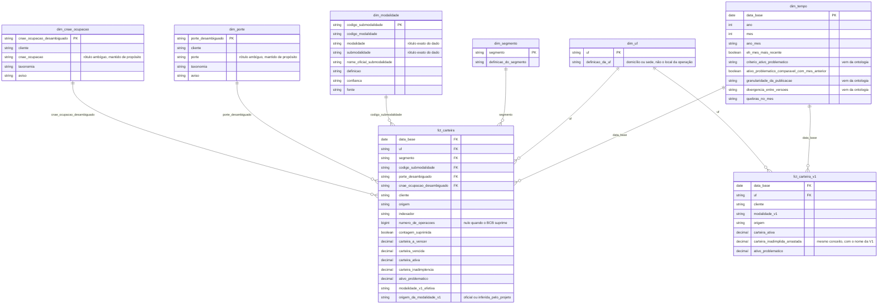
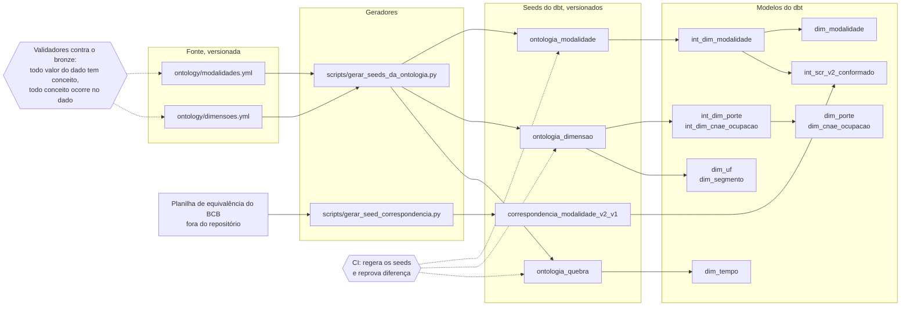
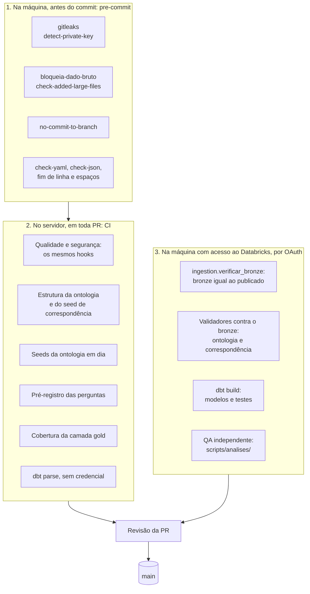

# Arquitetura em diagramas

Três diagramas que complementam o fluxo medalhão do [README](../README.md#arquitetura-medalhão). Eles são escritos em Mermaid e ficam neste arquivo, e não em imagem exportada, para que a PR que muda um modelo mude também o desenho. As regras estão no [ADR 0008](adr/0008-diagramas-como-codigo-em-mermaid.md).

No diagrama da ontologia, a seta pontilhada liga uma verificação àquilo que ela confere.

## Esquema estrela

É o que a IA consulta nas duas condições do experimento ([ADR 0007](adr/0007-gold-estrela-para-perguntas-apresentacao-para-dashboard.md)). O fato tem só chaves e medidas. Rótulos, definições e avisos moram nas dimensões, e qualquer consulta que queira um nome precisa fazer a junção.

`fct_carteira` guarda o grão cheio da V2. `fct_carteira_v1` é o fato legado, agregado, e existe para que as perguntas de comparação entre versões tenham dado da V1. Ele se liga só ao tempo e à UF, porque a taxonomia da V1 não é a das dimensões.

## Ontologia virando modelo

As dimensões não são escritas à mão no dbt. Elas são geradas dos arquivos da ontologia, e duas verificações seguram a coerência: o CI regera os seeds e reprova se o resultado diferir do versionado, e os validadores conferem, contra o bronze, que a ontologia descreve exatamente o dado que existe.

A correspondência entre as versões segue o mesmo desenho, com uma diferença: a fonte é a planilha oficial do BCB, que é dado bruto e fica fora do repositório ([ADR 0001](adr/0001-credenciais-e-dado-bruto-fora-do-repositorio.md) e [ADR 0003](adr/0003-conformacao-de-taxonomia-entre-versoes.md)). O que se versiona é o seed gerado dela.

`ontology/metricas.yml` não aparece no diagrama porque nenhum gerador o lê ainda. As definições das medidas estão nele, e os modelos o citam nos comentários.

## Camadas de defesa

A `main` é protegida, e toda mudança passa por branch e PR. Três camadas conferem o trabalho, e cada uma pega o que a anterior não alcança. As duas primeiras não usam credencial nenhuma. A terceira precisa do dado, e por isso roda só na máquina de quem tem acesso ao Databricks, autenticada por OAuth, sem credencial guardada em segredo do GitHub.

A terceira camada não roda no CI por decisão, e não por falta de configuração. O projeto não guarda credencial do Databricks em segredo do GitHub ([ADR 0001](adr/0001-credenciais-e-dado-bruto-fora-do-repositorio.md)). A orquestração pelo Asset Bundle, publicada da máquina local, está na #22.
