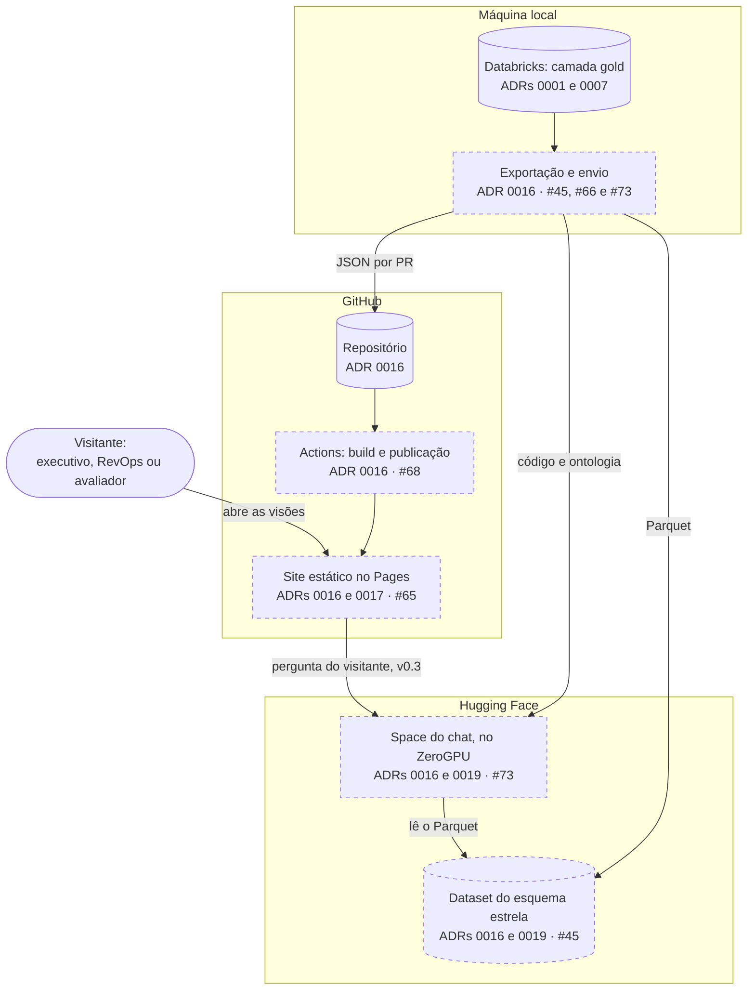
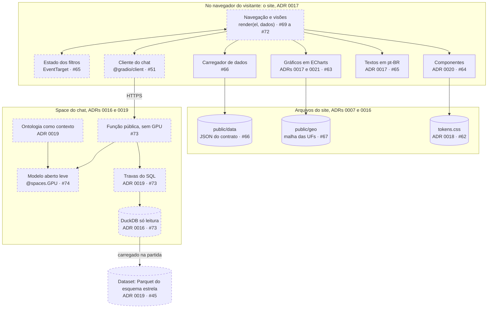
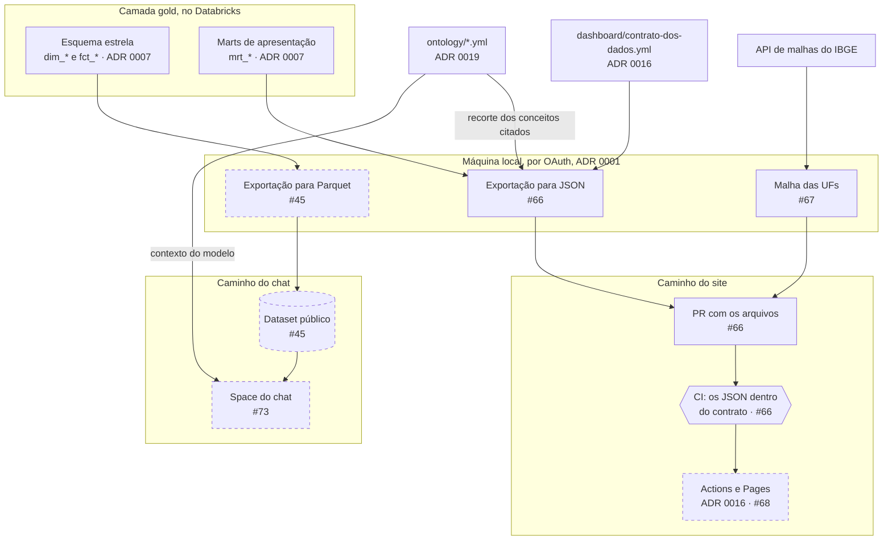
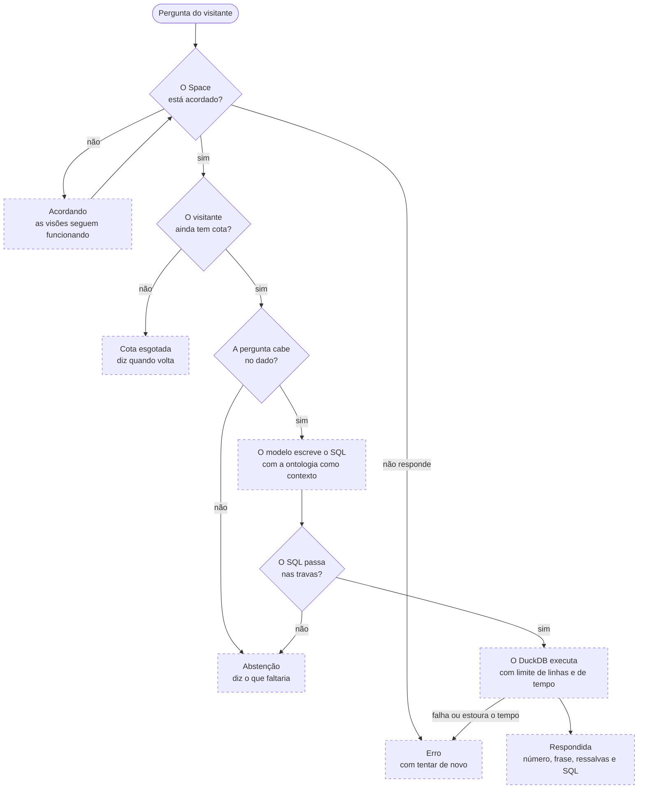

# Arquitetura do dashboard

Como o site, o dataset e o chat se ligam, o que trafega entre eles e o que acontece quando um deles não responde. Este documento junta o que os ADRs decidiram separadamente:
- onde cada peça roda: [ADR 0016](../adr/0016-site-estatico-no-github-pages-e-chat-no-zerogpu.md);
- como a interface é feita: [ADR 0017](../adr/0017-interface-em-javascript-sem-framework.md);
- o que o chat consulta: [ADR 0019](../adr/0019-chat-consulta-so-o-esquema-estrela.md);
- como a interface se parece: [ADR 0020](../adr/0020-design-system-carbon-com-camada-liquid-glass.md);
- as paletas de gráfico: [ADR 0021](../adr/0021-paletas-de-grafico-do-carbon-validadas.md).

O que o dashboard precisa fazer está nos [requisitos](requisitos.md), e as colunas de cada arquivo que o site lê estão no [contrato dos dados](../../dashboard/contrato-dos-dados.yml).

**Como ler os diagramas.** Eles seguem o [ADR 0008](../adr/0008-diagramas-como-codigo-em-mermaid.md): são Mermaid, usam só `flowchart`, e o que ainda não existe aparece tracejado, com a issue que o constrói. Cada peça traz no rótulo o ADR que a justifica. Boa parte ainda está tracejada. Existem a camada gold, a ontologia, o protótipo do design system, o contrato dos dados, o esqueleto do site, os tokens, os gráficos, os componentes, os arquivos de dados do site e a malha das UFs.

## As peças

| Peça | Onde roda | Quem publica | O que lê | ADR | Issue |
|---|---|---|---|---|---|
| Site | GitHub Pages | Workflow do Actions, sem segredo | Só os arquivos do próprio site | 0016 e 0017 | #65 e #68 |
| Arquivos do site | Dentro do site, em `dashboard/public/` | A máquina local, por PR | Os marts de apresentação e a ontologia | 0007 e 0016 | #66 e #67 |
| Dataset do esquema estrela | Hugging Face, público | A máquina local, com token de escopo fino | As tabelas `dim_*` e `fct_*` da camada gold | 0016 e 0019 | #45 |
| Space do chat | Hugging Face, no ZeroGPU | A máquina local, com o mesmo token | O dataset, e a ontologia empacotada com ele | 0016 e 0019 | #73 e #74 |
| Máquina local | O computador de quem mantém o projeto | Não se aplica | O Databricks, por OAuth | 0001 e 0016 | Não se aplica |

A máquina local é a única peça que toca o Databricks e a única que publica dado. Nenhuma outra peça guarda credencial ([ADR 0016](../adr/0016-site-estatico-no-github-pages-e-chat-no-zerogpu.md), decisão 5).

## Contexto

Quem usa o dashboard só fala com o site. O chat, da v0.3 em diante, é chamado pelo próprio navegador do visitante, direto no Space.



## Containers

O site é um conjunto de módulos JavaScript sem framework ([ADR 0017](../adr/0017-interface-em-javascript-sem-framework.md)), mais os arquivos estáticos que ele lê. O Space é uma aplicação Gradio com uma função pública, que roda sem GPU, e uma função com GPU, que só roda o modelo.



## Fluxo do dado

Dois caminhos saem da camada gold, e não se cruzam.



**Três fronteiras, que valem sempre:**
- **O site nunca lê o esquema estrela.** Ele recebe só os arquivos do contrato: recortes dos marts de apresentação e da ontologia.
- **O chat nunca lê os marts de apresentação.** O dataset tem só as tabelas `dim_*` e `fct_*` ([ADR 0019](../adr/0019-chat-consulta-so-o-esquema-estrela.md), decisão 1).
- **Nada de `evaluation/` sai do repositório,** nem para o site nem para o Space (ADR 0019, decisão 3).

**Datas-base diferentes por um tempo.** O site e o dataset são publicados em passos separados, e entre um passo e outro podem mostrar meses diferentes. A diferença fica visível, porque cada gráfico e cada resposta do chat mostram a sua data-base.

## Uma pergunta no chat



O Space devolve a resposta estruturada: o SQL, o resultado da execução, uma frase curta, as ressalvas que a ontologia associa aos conceitos usados e, na abstenção, o motivo e o que faltaria. A página monta a resposta com essas partes. O número exibido vem do resultado, e nunca do texto que o modelo escreveu (RF-C03).

| Estado | Como se detecta | O que o visitante vê | Componente do design system |
|---|---|---|---|
| Respondida | O Space devolve o SQL e o resultado | O número, a frase curta, as ressalvas e o SQL recolhido, com a data-base | Resposta do chat |
| Abstenção | O Space devolve abstenção, com o motivo | Que o dado não permite responder, e o que faltaria | Resposta do chat, sem número |
| Space dormindo | O cliente consulta o estado do Space na API do Hugging Face e recebe `SLEEPING` ou `STOPPED` [2] | O Space acordando, com o aviso de que as visões continuam funcionando | Chat acordando |
| Cota esgotada | O erro de cota do ZeroGPU, traduzido pela função pública do Space num estado próprio. Como o erro chega é conferido na #73 | Que a cota do dia acabou, e quando volta | Aviso de atenção |
| Erro | Falha de rede, tempo esgotado, ou Space pausado ou com erro | O problema e o botão de tentar de novo | Estado de erro |

**A cota que vale é a do visitante sem login.** O ZeroGPU dá 2 minutos de GPU por dia a quem não está logado no Hugging Face, e a cota volta 24 horas depois do primeiro uso [1]. O cabeçalho que identifica o visitante logado só é enviado quando a página roda dentro do próprio huggingface.co [2]. Chamado a partir do Pages, todo visitante conta como visitante sem login, e os 5 minutos da conta grátis não valem ali. É mais um motivo para o modelo ser leve (#74).

## Contrato dos arquivos

O contrato mora num arquivo só, [`dashboard/contrato-dos-dados.yml`](../../dashboard/contrato-dos-dados.yml). Ali estão:
- as colunas de cada arquivo, com tipo, unidade e se aceitam nulo;
- a definição de cada coluna, que aponta para um conceito da ontologia ou para o ADR que fixou a regra.

A exportação da #66 lê o contrato para saber o que exportar, e o CI reprova o arquivo que sair dele. Este documento só resume.

| Arquivo | De onde vem | Grão | Visões |
|---|---|---|---|
| `decisao.json` | `mrt_decisao` | UF e modalidade, só PJ, no último mês | 1, 2 e 4 |
| `carteira_mensal_pj.json` | `mrt_carteira_mensal` | Mês, UF e modalidade, só PJ | 2 |
| `carteira_por_uf.json` | `mrt_carteira_por_uf` | UF, no mesmo mês do `decisao.json` | 1 |
| `limites_do_dado.json` | `mrt_limites_do_dado` | Mês | 4 |
| `erro_da_reconstrucao.json` | `mrt_erro_da_reconstrucao` | Retrato do CNPJ e UF | 4 |
| `ontologia.json` | `ontology/*.yml` | Um registro por conceito citado nas colunas | 1, 2 e 4 |
| `manifesto.json` | A própria exportação | Data-base, parâmetros da decisão, linhas e sha256 de cada arquivo | 1, 2 e 4 |
| `geo/ufs.json` | API de malhas do IBGE (#67) | UF | 1 |

**Três regras do contrato:**
- **Só entra coluna que alguma visão usa.** Por isso o `mrt_reconciliacao_versoes` ficou fora: nenhuma visão da v0.1 o usa. O arquivo da visão 3 entra com a #27, na v0.2.
- **Os números vão sem formatação.** Fração de 0 a 1 e reais em reais. A formatação brasileira é feita só no site (RF-G10).
- **O JSON é por coluna, e não por linha.** O nome da coluna não se repete a cada linha, e o `dataset` do ECharts lê essa forma direto.

O manifesto não guarda data de geração. Rodar a exportação de novo com o mesmo dado produz os mesmos arquivos, byte a byte, como já acontece com a [`recomendacao.md`](../recomendacao.md).

### Exportação e validação

A exportação e a validação usam o mesmo módulo, [`scripts/contrato_do_dashboard.py`](../../scripts/contrato_do_dashboard.py), para ler o contrato, converter os valores e gravar os arquivos do mesmo jeito.
- **A exportação,** [`scripts/exportar_dados_do_dashboard.py`](../../scripts/exportar_dados_do_dashboard.py), roda na máquina local, pelo OAuth do Databricks. Ela não tem regra própria por arquivo: as colunas, o filtro (`onde`, `ultimo_mes` e `meses`) e a ordem das linhas (`ordem`) vêm do contrato. Depois de gravar, confere cada arquivo contra o mart com uma consulta independente: a contagem de linhas precisa ser igual, e a soma das colunas de reais pode diferir só pelo arredondamento, de até meio real por linha.
- **A validação,** [`scripts/validar_dados_do_dashboard.py`](../../scripts/validar_dados_do_dashboard.py), roda no CI, sem credencial. Ela confere colunas, tipos, nulos, valores permitidos, datas, a ordem do grão sem repetição, a data-base e a faixa de meses, a ausência de dado pessoal e que o `ontologia.json` e o `manifesto.json` são exatamente o que a exportação monta. O `--autoteste` estraga cópias dos arquivos de treze jeitos, e cada estrago precisa ser reprovado pelo motivo certo.
- **O que o `ontologia.json` traz:** os conceitos citados nas colunas, as modalidades que aparecem nos dados e o mapa de cada coluna para a sua definição. Coluna definida por ADR, como o índice de espaço, aponta para o ADR, e a visão mostra esse ADR no lugar do conceito (RF-G07).
- **Como os arquivos são gravados:** uma coluna por linha do arquivo, para o diff da PR mostrar qual coluna mudou. Reais vão em reais inteiros, e frações, diferenças, variações e índices, com seis casas.
- **O carregador do site,** em `dashboard/src/dados/`, busca cada arquivo uma vez só, mesmo que duas visões peçam. A falha vira um erro com o motivo, rede ou formato, para o estado de erro da visão, e não fica guardada: tentar de novo busca outra vez.

**Orçamento por visão.** O limite de 300 KB de dados do RNF-03 vale para cada visão, quando ela é a primeira a abrir. O `scripts/orcamento.js` soma os arquivos que o manifesto registra para cada visão, mais o próprio manifesto. Em jul/2026: 17,2 KB na visão 1, 226,3 KB na visão 2 e 18,6 KB na visão 4.

### Malha das UFs

A malha do mapa por UF segue o padrão da ingestão, em duas etapas, as duas na máquina local e sem credencial:
- **O download,** [`ingestion/baixar_malha.py`](../../ingestion/baixar_malha.py), baixa da API de malhas v3 do IBGE a malha territorial de 2022, na qualidade mínima, com o período escrito na URL [9]. Grava a resposta como veio, fora do git, e registra o sha256 no manifesto da ingestão. Antes, confere as 27 UFs de `dim_uf` pelo código do IBGE.
- **O arquivo do site,** [`scripts/gerar_malha_do_dashboard.py`](../../scripts/gerar_malha_do_dashboard.py), grava o `public/geo/ufs.json` com a geometria sem alteração, a sigla de cada UF, tirada da ontologia, e a fonte e a licença no topo [10, 11]. Confere, número por número, que a geometria saiu igual à da malha crua.
- **No CI,** a validação dos dados confere as 27 UFs, o par de código e sigla, os anéis, as casas decimais e o retângulo do Brasil. O controle negativo estraga a malha de sete jeitos.
- **O QA,** [`scripts/analises/qa_malha.py`](../../scripts/analises/qa_malha.py), confere a malha contra os metadados oficiais de cada UF na API do IBGE: o centroide cai dentro do polígono certo, o retângulo coincide e a fatia de cada UF na área do país fica a menos de 0,5 ponto da oficial.

**Por que a geometria não é simplificada.** A qualidade mínima já vem generalizada pelo IBGE e o arquivo do site pesa 28,9 KB comprimido, contra o limite de 100 KB do RNF-03. Arredondar as coordenadas para 3 casas economizaria 4,5 KB e faria sumir um polígono do Paraná. Simplificar UF por UF abriria frestas entre vizinhas, porque cada lado da mesma fronteira seria simplificado de um jeito.

**O que a qualidade mínima não traz:** as ilhas oceânicas. Fernando de Noronha, de PE, e Trindade e Martim Vaz, do ES, não aparecem no mapa. A UF do SCR é a da sede da empresa, e uma empresa com sede em Noronha conta para PE do mesmo jeito: o mapa só não desenha a ilha.

## Estrutura de pastas

O `dashboard/` é a raiz do site, e o Space do chat fica numa pasta própria, `space/`, na raiz do repositório. O site é JavaScript e o Space é Python, cada um publicado num lugar diferente. Com as pastas separadas, fica simples garantir o que vai para cada lugar.

```text
dashboard/                        raiz do site, no Vite (#65)
├── PRODUCT.md                    contexto de produto
├── contrato-dos-dados.yml        contrato dos arquivos que o site lê
├── prototipo-design-system/      protótipo aprovado no ADR 0020
├── index.html                    (#65)
├── catalogo.html                 catálogo do design system (#62 e #64)
├── src/
│   ├── visoes/                   uma pasta por visão, com render(el, dados) (#69 a #72)
│   ├── catalogo/                 as seções do catálogo (#62 e #64)
│   ├── cor/                      contraste pela WCAG (#62)
│   ├── componentes/              componentes do design system, com os ícones do Tabler (#64)
│   ├── graficos/                 tema do ECharts e componentes de gráfico (#63)
│   ├── formatos.js               números e datas no padrão brasileiro (#63)
│   ├── chat/                     cliente do Space e montagem da resposta (#51)
│   ├── dados/                    carregador dos arquivos do contrato (#66)
│   ├── textos/                   textos em pt-BR, prontos para o inglês (#65)
│   └── estilos/                  camadas de CSS, com o tokens.css gerado (#62)
├── tokens/                       tokens no formato DTCG (#62)
├── public/
│   ├── data/                     JSON exportados e manifesto (#66)
│   └── geo/                      malha das UFs (#67)
├── scripts/                      orçamento de carga e Lighthouse (#65)
└── tests/                        Vitest, e Playwright com axe (#65)

space/                            código do Space do chat (#73)
├── app.py                        Gradio: a função pública e a função com GPU
├── travas.py                     as travas do SQL
├── contexto.py                   a ontologia como contexto do modelo
├── empacotar.py                  monta o pacote pela lista do que pode ir
├── requirements.txt
└── tests/
```

A estrutura fina dos arquivos fica com a #65, no site, e com a #73, no Space.

## Segurança

### Política de segurança de conteúdo

Vai num `<meta>` do HTML, porque o Pages não deixa configurar cabeçalho HTTP ([ADR 0016](../adr/0016-site-estatico-no-github-pages-e-chat-no-zerogpu.md), decisão 1). A política proposta para a #68:

```text
default-src 'none';
script-src 'self';
style-src 'self';
style-src-attr 'unsafe-inline';
img-src 'self';
font-src 'self';
connect-src 'self';
base-uri 'self';
form-action 'none'
```

- **`connect-src`:** na v0.3 ganha dois endereços. Um é o `https://huggingface.co`, porque o cliente do Gradio consulta ali se o Space está dormindo [2]. O outro é o endereço do próprio Space, no formato `https://<usuario>-<space>.hf.space`. A conversa com o Space é por HTTPS, sem WebSocket [2].
- **`style-src-attr 'unsafe-inline'`:** é a única exceção, e é exigida pelo ECharts. Os dois renderizadores do ECharts 6.1.0, SVG e canvas, aplicam estilo pelo atributo `style` e pelo `cssText` [3], e é isso que essa diretiva controla [4]. Estilo em atributo não executa script. O risco que sobra é o texto do modelo trazer estilo próprio, e ele é fechado na sanitização, logo abaixo.
- **Não dá para impedir que outro site embuta o dashboard.** A diretiva `frame-ancestors` não funciona no `<meta>` [5]. É uma consequência já aceita no ADR 0016, e o site não tem login nem formulário que um site embutidor pudesse explorar.

### Texto do modelo

- O número da resposta entra na página como texto, a partir do resultado da execução, e não do texto do modelo.
- A frase curta passa pelo marked e depois pelo DOMPurify ([ADR 0017](../adr/0017-interface-em-javascript-sem-framework.md), decisão 4), com uma lista curta de etiquetas permitidas e sem o atributo `style`.
- O SQL é destacado pelo highlight.js a partir de texto puro. Nenhum HTML vindo do modelo entra no destaque.

### SQL só de leitura

As quatro travas do [ADR 0019](../adr/0019-chat-consulta-so-o-esquema-estrela.md) viram três camadas. Se uma falhar, as outras continuam valendo.
1. **Antes de rodar:** um comando só, só consulta, e só as tabelas do esquema estrela. A conferência usa um parser de SQL, e não busca de texto.
2. **No banco:**
   - o DuckDB é aberto em modo só leitura [6];
   - depois de carregar o esquema estrela, o acesso externo é desligado, o que impede ler arquivo ou endereço de dentro do SQL [7];
   - a carga automática de extensões é desligada, e a configuração é travada [7].
3. **Na execução:** limite de linhas, aplicado por fora do SQL gerado, e limite de tempo, que o DuckDB deixa para a aplicação [7].

### Nenhum segredo

Quem publica o quê, e com que credencial, está na tabela da decisão 5 do [ADR 0016](../adr/0016-site-estatico-no-github-pages-e-chat-no-zerogpu.md), que este documento não repete. Duas consequências práticas:
- O workflow do Pages pede só as permissões `pages: write` e `id-token: write` [8], e o repositório não tem nenhum segredo configurado para isso.
- O Space não tem segredo: ele lê um dataset público.

O gitleaks roda no pre-commit e no CI.

### O experimento fica protegido

- O site recebe só os arquivos do contrato.
- O Space é montado por `space/empacotar.py`, a partir de uma lista do que pode ir. Um teste reprova o pacote que contiver qualquer arquivo de `evaluation/` ou as perguntas de escolha do modelo da #74 (ADR 0019, decisão 3).

## Publicação

| Peça | Como publica | De onde | Credencial | Quando | Issue |
|---|---|---|---|---|---|
| Arquivos do site | A exportação escreve em `dashboard/public/data/`, e o resultado entra por PR | Máquina local | O login OAuth do Databricks, só na máquina | A cada mês novo do SCR | #66 |
| Malha das UFs | Baixada da API do IBGE, com o sha256 no manifesto da ingestão, e versionada por PR | Máquina local | Nenhuma | Quando o IBGE publicar outra malha | #67 |
| Site | Workflow do Actions: build do Vite e publicação no Pages | GitHub | O token efêmero do workflow | A cada merge na `main` que mexe em `dashboard/` | #68 |
| Dataset | Envio dos Parquet | Máquina local | Token de escopo fino, só na máquina | A cada mês novo do SCR | #45 |
| Space | Envio da pasta montada pela lista do que pode ir | Máquina local | O mesmo token | Quando o código ou o modelo mudam | #73 |

**A atualização de um mês novo,** em ordem:
1. Ingestão e `dbt build` na máquina local, como hoje.
2. `scripts/gerar_recomendacao.py` refaz a [`recomendacao.md`](../recomendacao.md).
3. A exportação escreve os JSON e o manifesto: `uv run python -m scripts.exportar_dados_do_dashboard` (#66).
4. A exportação escreve os Parquet e envia ao dataset (#45).
5. Uma PR leva a recomendação e os JSON, e o CI confere o contrato.
6. Com o merge, o Actions publica o site.

## Quando uma peça falha

| O que falha | O que o visitante vê | Por quê |
|---|---|---|
| O Pages | Nada abre | É a única peça sem alternativa. O dashboard não tem outro servidor |
| Um JSON não carrega | A visão que o usa mostra o estado de erro, e as outras seguem | Cada visão carrega só os arquivos que usa (RF-G11) |
| Um JSON sai do contrato | Nada: o arquivo não chega ao site | O CI reprova a PR (#66) |
| A malha das UFs | O mapa mostra o estado de erro, e o ranking e a tabela seguem. O cartograma de grade não depende da malha, e pode tomar o lugar do mapa, o que se decide na #69 | RF-103 |
| O Space está dormindo | O chat acordando, e as visões seguem | ADR 0016, decisão 4 |
| A cota do visitante acabou | O aviso de cota esgotada, com a hora em que volta | ADR 0016, decisão 2 |
| O dataset está fora | O Space não carrega o dado na partida, e o chat mostra erro. As visões seguem | As visões não dependem do chat (RNF-07) |
| O SQL gerado não passa nas travas | Abstenção, com o motivo | ADR 0019, decisão 6 |

## Decisões

| Data | Decisão | Registro |
|---|---|---|
| 2026-09-26 | Os gráficos não trazem conclusão escrita, para controlar o escopo. Quem quiser uma conclusão pergunta ao chat | [Design system](design-system.md); [requisitos](requisitos.md); ADR 0020 |
| 2026-09-26 | O código do Space fica em `space/`, na raiz, e o `dashboard/` fica só com o site | Este documento |
| 2026-09-26 | O contrato dos arquivos do site é um YAML, fonte única, lido pela exportação e pelo CI | Este documento; [contrato](../../dashboard/contrato-dos-dados.yml) |
| 2026-09-26 | Um JSON por mart, por coluna, só com as colunas que alguma visão usa | Este documento; contrato |
| 2026-09-26 | A política de segurança aceita estilo em atributo, porque o ECharts precisa. Script e folha de estilo continuam sem `unsafe-inline` | Este documento; requisitos, RNF-11 |
| 2026-09-27 | As paletas de gráfico saem do Carbon, com a categórica ajustada, e um teste automatizado reprova paleta fora dos critérios | ADR 0021 |
| 2026-09-27 | O tema de cada gráfico é o do lugar onde ele está, e a troca de tema atualiza a mesma instância do ECharts, sem recriar o gráfico. O renderizador é o SVG, cujas texturas não usam imagem embutida | Este documento; [design system](design-system.md) |
| 2026-09-27 | Os exemplos do catálogo usam dado real, gerado dos marts por `scripts/gerar_exemplos_do_catalogo.py`, sem número digitado à mão | [Design system](design-system.md) |
| 2026-09-27 | Os ícones do Tabler entram pelo pacote, e o build junta só os usados. A fonte do Tabler pelo CDN, como no protótipo, violaria o `style-src` e o `font-src` da política de segurança | Este documento; [design system](design-system.md) |
| 2026-09-27 | O tema escolhido pelo visitante é aplicado por um script pequeno e síncrono no `<head>`, servido pelo próprio site, que a política aceita em `script-src 'self'` | Este documento; ADR 0018 |
| 2026-09-27 | O limite de 300 KB de dados do RNF-03 vale por visão, quando ela é a primeira a abrir, e não para todos os arquivos juntos | Este documento; [requisitos](requisitos.md), RNF-03 |
| 2026-09-27 | O `carteira_mensal_pj.json` leva os 31 meses mais recentes, a série inteira da V2 desde jan/2024. Com eles, a visão 2 carrega 226,3 KB. O número é fixo: a cada mês novo, o mais antigo sai | Este documento; contrato |
| 2026-09-27 | O `ontologia.json` traz, além dos conceitos citados, um registro por modalidade presente nos dados e o mapa de cada coluna para a sua definição | Este documento; contrato |
| 2026-09-27 | Os JSON são gravados com uma coluna por linha, reais em reais inteiros e frações com seis casas | Este documento; contrato |
| 2026-10-01 | A malha das UFs vai como o IBGE publica: a de 2022, na qualidade mínima, sem arredondar nem simplificar. Cabe em 28,9 KB comprimida, e arredondar para 3 casas economizaria 4,5 KB ao custo de um polígono do Paraná | Este documento; contrato |
| 2026-10-01 | O mapa fica sem as ilhas oceânicas, que a qualidade mínima não traz: Fernando de Noronha e Trindade e Martim Vaz | Este documento; [design system](design-system.md) |
| 2026-10-01 | O período da malha fica escrito na URL, e o download segue o padrão da ingestão, com o sha256 no manifesto | Este documento; `ingestion/fontes.py` |

## Pontos em aberto

| Ponto | Onde se resolve |
|---|---|
| O endereço exato do Space no `connect-src`, que só existe quando o Space for criado | #68 e #73 |
| Como o erro de cota do ZeroGPU chega à função pública do Space, para virar um estado próprio | #73 |
| Conferir, com o Space publicado, que a cota vale como a de visitante sem login | #73 |
| O denominador da visão 1 sem filtro de modalidade. O `mrt_carteira_por_uf` conta empresas de todas as naturezas jurídicas. O `mrt_decisao` conta só as de natureza empresarial, sem MEI, como decidiu o [ADR 0014](../adr/0014-matriz-de-decisao-espaco-contra-risco.md). A visão precisa de um denominador só | #69 |

## Fontes

1. Hugging Face, "Spaces ZeroGPU", acessado em 2026-09-26: cota diária de 2 minutos para quem não está logado e de 5 minutos para conta grátis, renovada 24 horas depois do primeiro uso. https://huggingface.co/docs/hub/spaces-zerogpu
2. `@gradio/client` 2.7.0, código publicado no npm, lido em 2026-09-26:
   - a função `check_space_status` consulta `huggingface.co/api/spaces` e trata `SLEEPING` e `STOPPED` como Space dormindo;
   - a função `get_zerogpu_origin` só envia o cabeçalho do ZeroGPU quando a página roda em `*.hf.space`, dentro do huggingface.co;
   - o cliente não aceita o protocolo por WebSocket, que era do Gradio 3, e conversa por eventos sobre HTTPS.

   https://cdn.jsdelivr.net/npm/@gradio/client@2.7.0/dist/index.js
3. ECharts 6.1.0, código publicado no npm, lido em 2026-09-26: os renderizadores SVG e canvas aplicam estilo pelo atributo `style` e pelo `cssText`. https://cdn.jsdelivr.net/npm/echarts@6.1.0/dist/echarts.js
4. MDN, `style-src-attr`, acessado em 2026-09-26: controla o atributo `style`, o `setAttribute("style")` e o `cssText`, e funciona nos navegadores desde dezembro de 2022. https://developer.mozilla.org/en-US/docs/Web/HTTP/Reference/Headers/Content-Security-Policy/style-src-attr
5. MDN, `frame-ancestors`, acessado em 2026-09-26: a diretiva não funciona no elemento `<meta>`. https://developer.mozilla.org/en-US/docs/Web/HTTP/Reference/Headers/Content-Security-Policy/frame-ancestors
6. DuckDB, API de Python, acessado em 2026-09-26: `duckdb.connect(database=..., read_only=True)`. https://duckdb.org/docs/current/clients/python/dbapi.html
7. DuckDB, "Securing DuckDB", acessado em 2026-09-26: `enable_external_access`, `autoload_known_extensions`, `autoinstall_known_extensions` e `lock_configuration`; tempo limite no nível da aplicação. https://duckdb.org/docs/current/operations_manual/securing_duckdb/overview.html
8. GitHub Docs, "Using custom workflows with GitHub Pages", acessado em 2026-09-26: permissões `pages: write` e `id-token: write`. https://docs.github.com/en/pages/getting-started-with-github-pages/using-custom-workflows-with-github-pages
9. IBGE, API de malhas v3, documentação e respostas de 2026-10-01: sem o parâmetro `periodo`, a API devolve a malha de 2022, com o mesmo sha256 do pedido com `periodo=2022`, e os períodos de 2023 a 2025 devolviam erro 500. https://servicodados.ibge.gov.br/api/docs/malhas?versao=3
10. IBGE, Leia-me da Malha Municipal Digital 2022, acessado em 2026-10-01: os limites são aproximados e não são a demarcação oficial da divisão político-administrativa. https://geoftp.ibge.gov.br/organizacao_do_territorio/malhas_territoriais/malhas_municipais/municipio_2022/Leia_me.pdf
11. IBGE, Plano de Dados Abertos 2020-2022, glossário, acessado em 2026-10-01: licença aberta é a que permite usar, reutilizar e redistribuir o dado, exigindo no máximo o crédito da autoria e o compartilhamento pela mesma licença. https://www.ibge.gov.br/np_download/novoportal/documentos_institucionais/Plano_de_Dados_Abertos_IBGE_2020_2022_1arevisao.pdf
